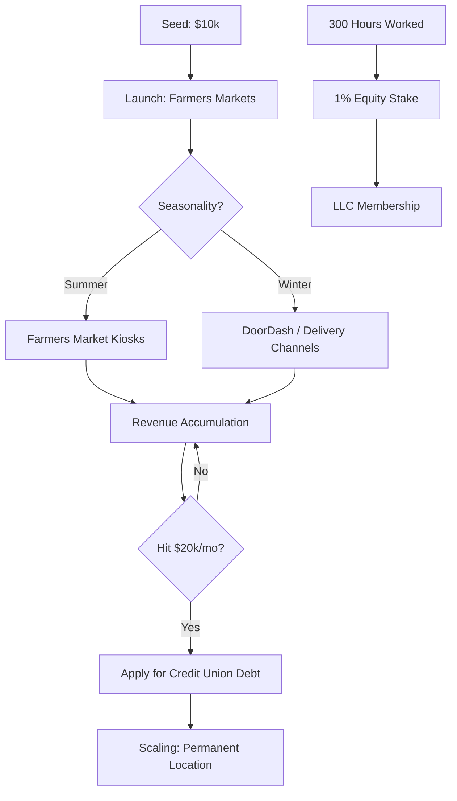

# Proposal: Japanese Artisanal Ice Cream (Broomfield, CO)

> [!INFO] **Executive Summary**
> This proposal outlines a lean, community-driven launch for an authentic Japanese ice cream brand based in **Broomfield, Colorado**. The venture is structured as an **LLC** leveraging a unique "sweat-equity" model for the local Japanese Mom Community. With an initial **$10,000 investment** in refurbished equipment, the business will utilize a dual-track sales strategy: **Farmers Markets** for seasonal validation and **Third-Party Delivery (DoorDash)** for year-round revenue. Capital expansion via **Credit Unions** will be triggered upon reaching a **$20,000 monthly revenue** milestone.

---

## 1. Ownership & Equity Model: "Sweat Equity"
To ensure cultural authenticity and operational excellence, the LLC utilizes a performance-based vesting schedule for its community-led workforce.

*   **Entity Structure:** LLC with community-allocated shares.
*   **Vesting Rate:** **300 Hours Worked = 1% Equity Stake**.
*   **Target Group:** Local Japanese Mom Community.
*   **Objective:** This model incentivizes long-term commitment and high-quality production while rewarding those who contribute the most to the daily operations.

---

## 2. Product Economics & Revenue Strategy
The business follows a premium pricing model supported by the unique nutritional profile of the product.

*   **Unit Pricing:** **$10.00 per cup**.
*   **Core Value Prop:** Authentic Japanese flavors (Matcha, Hojicha, Yuzu) with a "less-sugary" profile.
*   **Scaling Trigger:** Institutional debt financing will be sought once the business maintains **$20,000/month in revenue** (approx. 2,000 units sold).

---

## 3. Market Strategy & Seasonal Continuity
The business model accounts for the seasonal nature of Colorado's outdoor markets by diversifying distribution channels.

### 3.1 Peak Season (Spring/Summer)
*   **Primary Channel:** High-traffic **Farmers Markets** in the Broomfield and North Denver metro areas.
*   **Equipment:** Refurbished batch freezers and mobile pop-up kiosks/carts.

### 3.2 Off-Season (Winter Strategy)
*   **Primary Channel:** Delivery-focused operations through **DoorDash** and other distribution platforms.
*   **Logistics:** Transition to a "Dark Kitchen" or shared-commissary model to fulfill delivery orders, ensuring consistent revenue toward the $20k monthly goal during colder months.

---

## 4. Capitalization & Scaling
The venture follows a "Proof-of-Concept" to "Leveraged Growth" trajectory.

| Phase | Capital Source | Allocation |
| :--- | :--- | :--- |
| **Phase 1: Seed** | $10,000 Initial Fund | Refurbished equipment, LLC formation, Market permits. |
| **Phase 2: Growth** | **Credit Unions** (Debt) | Triggered at **$20k/mo revenue**. Funds permanent retail site or fleet expansion. |
| **Phase 3: Mature** | Internal Cash Flow | Continued equity vesting for community members; dividend distribution. |

---

## 5. Execution Roadmap

1.  **Month 1: Legal & Infrastructure**
    *   Form LLC and finalize Operating Agreement with **300hr/1% vesting** clauses.
    *   Procure used/refurbished batch freezer and mobile cart.
2.  **Month 2: Onboarding & Permitting**
    *   Onboard the Japanese Mom Community.
    *   Secure health department and mobile vending permits for Broomfield.
3.  **Month 3: Launch**
    *   Initiate sales at local Farmers Markets.
    *   Set up DoorDash storefront for delivery fulfillment.
4.  **Month 4+: Threshold Monitoring**
    *   Track monthly revenue. On attainment of **$20,000 sustained revenue**, initiate applications with local **Credit Unions** for expansion capital.

---

> [!CHECKLIST] **Next Steps for the Founder**
> *   [ ] **Legal:** Draft the LLC Operating Agreement specifically detailing the 300-hour vesting logic.
> *   [ ] **Operational:** Identify a shared commissary kitchen in Broomfield that allows for both production and DoorDash pickup.
> *   [ ] **Financial:** Begin a shortlist of local Credit Unions for preliminary debt-financing discussions.
