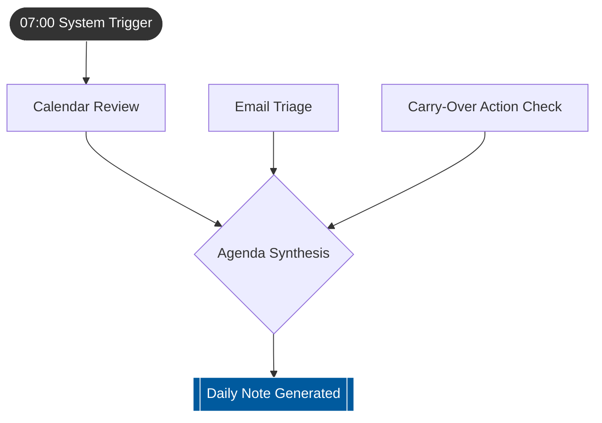

# Skill Deployment Brief: Daily Preparation

> [!INFO] Executive Summary
> A new automated workflow, **Daily Preparation**, has been successfully provisioned and deployed to [[daily_preparation]]. This routine runs daily at 07:00 to synthesize schedules, communications, and residual tasks into a single actionable Daily Note. 

### Execution Flow

### Operational Steps

| Phase | Sub-routine | Core Objective |
| :--- | :--- | :--- |
| **1. Schedule Sync** | Calendar Review | Extracts current day's meetings, blocked time, and critical deadlines. |
| **2. Comms Triage** | Email Scan | Parses unread/recent emails to flag urgent requests and incoming action items. |
| **3. State Recovery** | Carry-Over Check | Reviews the previous day's output to extract and reprioritize incomplete tasks. |
| **4. Synthesis** | Agenda Generation | Consolidates inputs into a structured markdown document outlining schedule, top priorities, and briefing contexts. |

### Expected Deliverable
The automation outputs a unified **Daily Note** directly into the vault each morning. This note serves as the single source of truth for the day's execution.

> [!CHECKLIST] Chief of Staff Action Items
> - [x] Verify that the generated Daily Note format aligns with preferred operational reporting structures. *(Completed)*
> - [x] Confirm if specific calendar accounts or email folders need explicit inclusion/exclusion rules. *(Completed)*