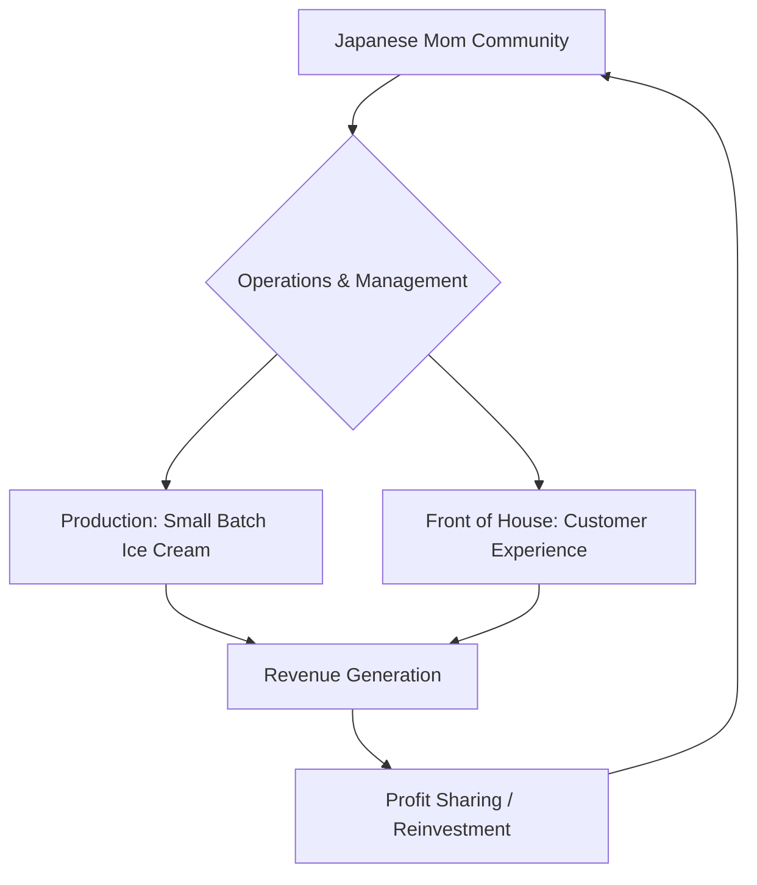
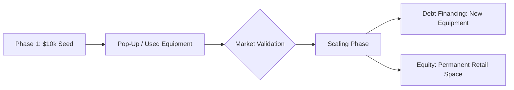
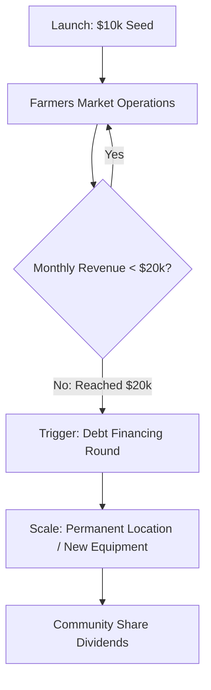
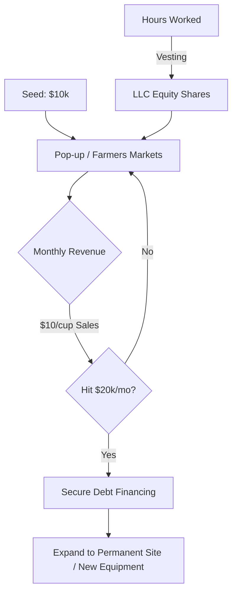
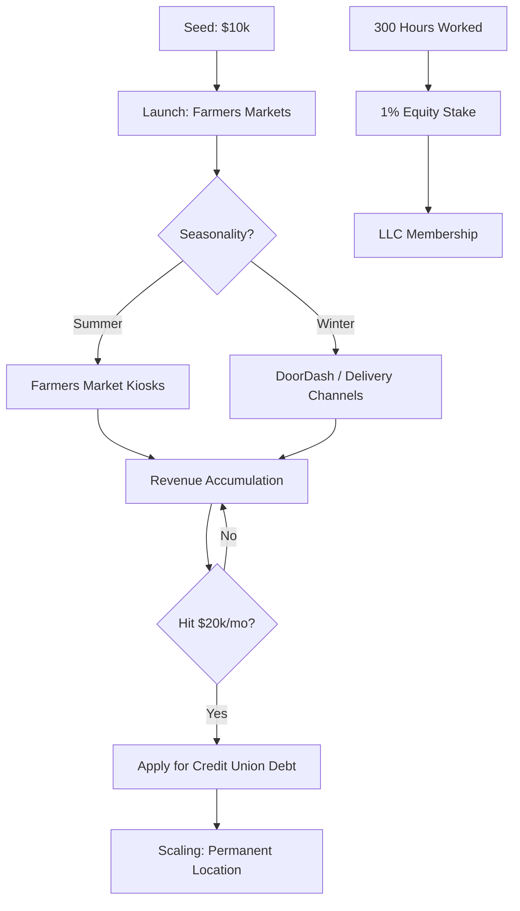

**[Sherpa] (user):**
help me draft an email
---

**[Sherpa] (assistant):**
*Transferred session to **Chief of Staff**.*

> The user needs assistance drafting an email. They haven't provided specific details about the content or recipient yet. Please help them clarify the purpose of the email and generate a draft.
---

**[Chief of Staff] (assistant):**
I'll help you draft that email. To ensure it's effective and aligns with your objectives, I need some specific details.

Please fill out the form below:

```json-form
{
  "title": "Email Drafting Requirements",
  "fields": [
    {
      "id": "recipient",
      "label": "Who is the recipient? (Name/Title/Relationship)",
      "type": "textarea",
      "placeholder": "e.g., Sarah, VP of Engineering at [Company]"
    },
    {
      "id": "purpose",
      "label": "What is the primary objective of this email?",
      "type": "textarea",
      "placeholder": "e.g., Requesting a follow-up meeting regarding the Q3 project roadmap."
    },
    {
      "id": "key_points",
      "label": "What are the non-negotiable points or data that must be included?",
      "type": "textarea",
      "placeholder": "e.g., Mention the 15% budget surplus and the need for approval by Friday."
    },
    {
      "id": "tone",
      "label": "What is the desired tone?",
      "type": "textarea",
      "placeholder": "e.g., Professional and urgent, or casual and exploratory."
    }
  ]
}
```
---

**[Sherpa] (user):**
**Who is the recipient? (Name/Title/Relationship)**
Natsuko

**What is the primary objective of this email?**
Coordinate kiddo pickup

**What are the non-negotiable points or data that must be included?**
- will use whatapp for texting
- 30 minutes notice


**What is the desired tone?**
familiar family
---

**[Sherpa] (assistant):**
Hi Natsuko,

Here is a draft for your email:

***

**Subject:** Quick update on pickup today

Hi Natsuko,

I'm looking forward to seeing you later! Just wanted to coordinate the pickup for today.

Let's use WhatsApp for texting to stay in touch about the timing. I'll make sure to give you at least 30 minutes' notice before I head over.

See you soon!

***

How does this look to you? Would you like me to make any changes or send it to a specific file in your vault?
---

**[Sherpa] (user):**
I want to write a proposal for an ice cream shop
---

**[Sherpa] (assistant):**
*Transferred session to **Technical Writer**.*

> The user wants to write a proposal for an ice cream shop. They need help structuring and drafting this document. Please guide them through the process of creating an executive-level proposal for this business idea.
---

**[Technical Writer] (assistant):**
I am ready to help you transform your ice cream shop concept into a professional, executive-level proposal. To ensure this document is structured for senior-level review and potential investors, I need to gather the core technical and operational details of your vision.

Please provide the following information so I can begin drafting the proposal.

```json-form
{
  "title": "Ice Cream Shop Proposal Details",
  "fields": [
    {
      "id": "concept_name",
      "label": "Business Name & Core Concept",
      "type": "textarea",
      "placeholder": "e.g., 'Sub-Zero Scoops', a high-tech nitrogen ice cream lab focused on custom flavor profiles."
    },
    {
      "id": "target_market",
      "label": "Target Audience & Location",
      "type": "textarea",
      "placeholder": "Who are the primary customers and where is this located?"
    },
    {
      "id": "unique_value_prop",
      "label": "Unique Value Proposition (UVP)",
      "type": "textarea",
      "placeholder": "What separates this from a standard Baskin-Robbins? (e.g., local sourcing, proprietary tech, specific dietary focus)."
    },
    {
      "id": "operational_model",
      "label": "Operational Model",
      "type": "textarea",
      "placeholder": "Briefly describe the production and service flow. (e.g., Made-to-order vs. pre-churned, retail vs. wholesale)."
    },
    {
      "id": "financial_ask",
      "label": "Funding or Resource Requirements",
      "type": "textarea",
      "placeholder": "What is the primary goal of this proposal? (e.g., Securing $150k in seed funding, obtaining a lease, or finding a technical partner)."
    }
  ]
}
```

Once you submit these details, I will structure the proposal into the following sections:
1. **Executive Summary**: High-level overview for immediate impact.
2. **Market Opportunity**: Evidence-based reasoning for the business.
3. **Operational Strategy**: How the shop functions at a technical level.
4. **Competitive Analysis**: Where you sit in the current landscape.
5. **Execution Roadmap**: Key milestones for launch.
---

**[Technical Writer] (user):**
**Business Name & Core Concept**
Japanese ice creme shop

**Target Audience & Location**
Families especially those who internally travel and appreciate Japanese ice cream confections

**Unique Value Proposition (UVP)**
Authentic Japanese Flavors
Less Sugary Profiles
Unique Creations
Great place to reward the kids

**Operational Model**
Family owned and operated by Japanese Mom communities
Profit sharing and ownership

**Funding or Resource Requirements**
Equipment costs
---

**[Technical Writer] (assistant):**
# Proposal: Japanese Artisanal Ice Cream Concept

> [!INFO] **Executive Summary**
> This proposal outlines the development of an authentic Japanese ice cream shop targeting families and international travelers. The venture distinguishes itself through a "less-sugary" nutritional profile and a community-centric operational model powered by Japanese expatriate mothers. The primary objective of this document is to secure funding for specialized production equipment.

---

## 1. Concept Overview
The shop will specialize in high-quality, authentic Japanese confections, bridging the gap between traditional dessert techniques and modern health preferences (lower glycemic impact).

### 1.1 Unique Value Proposition (UVP)
*   **Authentic Flavor Profiles:** Utilization of traditional ingredients (e.g., Matcha, Hojicha, Miso, Black Sesame, Yuzu).
*   **Reduced Sugar Formulation:** Focus on the "less sweet" profile preferred in Japanese palate standards compared to Western alternatives.
*   **Unique Creations:** Seasonal and regional Japanese specialties not found in mass-market chains.
*   **Family-Centric Experience:** Designed as a "reward destination" for children and families.

---

## 2. Operational Model
The business utilizes a cooperative-style management structure, leveraging the expertise and cultural authenticity of the local Japanese community.

### 2.1 Staffing & Ownership
*   **Community-Led:** Operated by Japanese mothers, ensuring cultural integrity and authentic customer service.
*   **Incentive Structure:** A profit-sharing and ownership model designed to ensure long-term retention and high operational standards.

### 2.2 Workflow Diagram


---

## 3. Market Positioning
The concept targets a specific niche within the premium frozen dessert market.

| Segment | Interest | Focus |
| :--- | :--- | :--- |
| **Families** | Reward/Experience | Clean ingredients, kid-friendly environment. |
| **Intl. Travelers** | Authenticity | Nostalgia for Japanese flavors, "global" taste standards. |
| **Health Conscious** | Nutritional Profile | Reduced sugar, natural ingredients. |

---

## 4. Resource Requirements: Equipment
The primary capital requirement for this phase is the procurement of professional-grade manufacturing and storage equipment.

*   **Batch Freezers:** High-precision units capable of achieving the specific textures required for Japanese-style ice cream.
*   **Pasteurizers:** For safe, in-house base production.
*   **Display Cases:** Specialized gelato/ice cream dipping cabinets with precise temperature controls to maintain product integrity.
*   **Blast Chillers:** To ensure rapid cooling and minimize ice crystal formation.

---

## 5. Execution Roadmap
1.  **Phase 1:** Finalize equipment list and vendor selection.
2.  **Phase 2:** Secure location and complete health department permitting.
3.  **Phase 3:** Onboard community operators and finalize profit-sharing legalities.
4.  **Phase 4:** Soft launch and community tasting events.

---

> [!CAUTION] **Missing Context**
> To finalize this proposal for formal submission, the following details are required:
> *   **Specific Location:** Has a city or neighborhood been identified?
> *   **Financial Estimates:** Specific dollar amounts for the "Equipment Costs."
> *   **Legal Structure:** The specific type of entity (LLC, Cooperative, etc.) to support the profit-sharing model.
---

**[Sherpa] (user):**
Broomfield Colorado
10,000 USD
LLC
---

**[Sherpa] (assistant):**
*Transferred session to **Technical Writer**.*

> The user has provided specific details for the ice cream shop proposal: Location is Broomfield, Colorado; the initial budget/investment is $10,000 USD; and the legal structure will be an LLC. Please integrate these details into the formal proposal document.
---

**[Technical Writer] (assistant):**
This updated proposal incorporates the specific location, financial constraints, and legal structure provided. 

# Proposal: Japanese Artisanal Ice Cream Concept (Broomfield, CO)

> [!INFO] **Executive Summary**
> This proposal outlines the establishment of an authentic Japanese ice cream shop in **Broomfield, Colorado**. Operating as a **Limited Liability Company (LLC)**, the venture focuses on a "less-sugary" nutritional profile and a community-centric operational model powered by local Japanese expatriate mothers. The initial phase requires a **$10,000 USD investment** primarily dedicated to essential production equipment.

---

## 1. Concept Overview
The shop will serve as a destination for high-quality, authentic Japanese confections, filling a market gap in the Broomfield/North Metro Denver area for health-conscious, culturally authentic desserts.

### 1.1 Unique Value Proposition (UVP)
*   **Authentic Flavor Profiles:** Utilization of traditional ingredients (e.g., Matcha, Hojicha, Miso, Black Sesame, Yuzu).
*   **Reduced Sugar Formulation:** Targeted at the "less sweet" preference standard in Japanese culinary traditions.
*   **Unique Creations:** Seasonal specialties and regional Japanese formats.
*   **Family-Centric Experience:** Positioned as a rewarding, high-quality destination for local families and international travelers.

---

## 2. Operational & Legal Model
The business is structured to balance professional agility with community involvement.

### 2.1 Legal Structure: LLC
The business will be registered as an **LLC**. This provides:
*   **Liability Protection:** Separating personal assets from business risks.
*   **Operational Flexibility:** Simplifies the profit-sharing and ownership model for the participating community members.

### 2.2 Community-Led Operations
*   **Staffing:** Operated by Japanese mothers in the Broomfield area, ensuring cultural integrity.
*   **Incentives:** A profit-sharing model designed to encourage high operational standards and community reinvestment.

---

## 3. Market Positioning: Broomfield, CO
Broomfield is a strategic choice due to its growing family population and its proximity to major transit corridors frequented by international travelers.

| Segment | Interest | Focus |
| :--- | :--- | :--- |
| **Broomfield Families** | Reward/Experience | Clean ingredients, kid-friendly environment. |
| **Intl. Travelers** | Authenticity | Nostalgia for Japanese flavors, "global" taste standards. |
| **Health Conscious** | Nutritional Profile | Reduced sugar, natural ingredients. |

---

## 4. Resource Requirements: Phase 1 Investment
The initial **$10,000 USD** capital injection will be allocated toward essential manufacturing and storage assets.

> [!CHECKLIST] **Initial Equipment Focus ($10k Budget)**
> *   **Primary Batch Freezer:** Acquisition of a high-efficiency tabletop or refurbished commercial unit.
> *   **Storage & Display:** Specialized freezer units with precise temperature controls.
> *   **Initial Inventory:** Sourcing authentic Japanese powders (Matcha/Hojicha) and base ingredients.
> *   **Compliance:** Basic kitchen modifications to meet Broomfield health code requirements.

---

## 5. Execution Roadmap
1.  **Phase 1 (Month 1):** LLC Registration and equipment sourcing within the $10,000 budget.
2.  **Phase 2 (Month 2):** Secure a micro-lease or shared-kitchen space in Broomfield.
3.  **Phase 3 (Month 3):** Finalize community operator agreements and profit-sharing tiers.
4.  **Phase 4 (Month 4):** Launch and local community tasting events.

---

> [!CAUTION] **Missing Context**
> To further refine this for a bank or landlord, consider the following:
> *   **Facility Status:** Have you identified a specific retail front or a shared commissary kitchen in Broomfield?
> *   **Equipment Specifics:** Given the $10,000 budget, will you be pursuing used equipment, or is this intended for a "pop-up" style setup (e.g., carts/kiosks)?
> *   **Scaling Plan:** How will the LLC transition from a family-run operation to a scalable model once the $10k seed is exhausted?
---

**[Technical Writer] (user):**
Facility Status:  TBD
Equipment: used equipment and pop/up
Scaling: A mix of debt and company shares
---

**[Technical Writer] (assistant):**
# Proposal: Japanese Artisanal Ice Cream Concept (Broomfield, CO)

> [!INFO] **Executive Summary**
> This proposal outlines a lean, high-agility launch for an authentic Japanese ice cream brand in **Broomfield, Colorado**. Operating as an **LLC**, the business will utilize a **$10,000 initial investment** to deploy a pop-up/mobile model using refurbished equipment. Growth will be facilitated through a hybrid scaling strategy involving both debt financing and equity distribution (shares).

---

## 1. Operational Model: Lean Entry
To maximize the $10,000 budget and validate the market without high fixed overhead, the business will bypass a traditional brick-and-mortar storefront in Phase 1.

### 1.1 Facility & Setup
*   **Status:** TBD (Active search for shared commissary kitchens or high-traffic pop-up zones in Broomfield).
*   **Format:** Pop-up kiosks or mobile carts. This allows for testing different high-traffic locations (farmers markets, local festivals, shopping centers) before committing to a long-term lease.

### 1.2 Equipment Strategy
By sourcing **used/refurbished equipment**, the venture can secure professional-grade manufacturing capabilities within the $10k constraint.

> [!CHECKLIST] **Phase 1 Procurement List**
> *   **Refurbished Batch Freezer:** Small-footprint commercial unit for authentic texture.
> *   **Mobile Display/Dipping Cart:** Insulated or powered unit for pop-up service.
> *   **Storage:** Compact, high-efficiency chest freezers for base and inventory storage.
> *   **Transport:** Portable logistics gear for mobile deployment.

---

## 2. Financial & Scaling Strategy
The venture is designed to start lean and scale via a multi-layered capital approach.

### 2.1 Initial Seed ($10,000)
*   Used equipment acquisition.
*   Initial ingredient sourcing (Authentic Matcha, Hojicha, etc.).
*   Licensing, LLC formation, and health permits.

### 2.2 Growth & Capitalization
As the concept proves its viability through pop-up revenue, scaling will be funded via:
*   **Debt Financing:** Utilization of small business loans or lines of credit for predictable equipment expansion.
*   **Equity Distribution:** Offering company shares to key community partners and investors to fund permanent facility acquisition.



---

## 3. Competitive Advantage: The "Community-First" Model
The LLC structure supports a unique operational workforce that doubles as a brand differentiator.

| Feature | Execution |
| :--- | :--- |
| **Authenticity** | Direct oversight by Japanese mothers (Broomfield community). |
| **Ownership** | Profit-sharing model ensures high quality and low turnover. |
| **Product** | "Less-sugary" profile appealing to health-conscious families. |
| **Mobility** | Low-risk "Pop-up" model allows for data-driven location selection. |

---

## 4. Execution Roadmap (Revised)
1.  **Month 1:** LLC registration and equipment sourcing (Refurbished/Used).
2.  **Month 2:** Secure permits for pop-up operations in Broomfield; finalize "Mom Community" profit-sharing contracts.
3.  **Month 3:** Launch mobile/pop-up operations at local events.
4.  **Month 6+:** Review revenue data; initiate debt/equity round for permanent facility expansion.

---

> [!CAUTION] **Missing Context**
> To finalize the scaling plan, additional details are needed:
> *   **Share Structure:** What percentage of the LLC is reserved for the "Mom Community" vs. outside investors?
> *   **Pop-Up Targets:** Have specific Broomfield events or locations (e.g., Flatiron Crossing, local farmers markets) been contacted?
> *   **Debt Threshold:** What is the specific revenue milestone required before seeking debt financing?
---

**[Technical Writer] (user):**
Share Structure: Mom Community
Pop-up Targets: farmers markets
Debt Threshold: 20K $ a month
---

**[Technical Writer] (assistant):**
# Proposal: Japanese Artisanal Ice Cream (Broomfield, CO)

> [!INFO] **Executive Summary**
> This proposal outlines a lean launch strategy for a Japanese artisanal ice cream brand based in **Broomfield, Colorado**. The venture will operate as an **LLC** with a community-centric ownership structure. Utilizing an initial **$10,000 investment** for refurbished equipment, the business will launch via **farmers markets** to validate the product. Scaling will commence once a revenue milestone of **$20,000/month** is achieved, triggered by a hybrid of debt financing and internal equity distribution.

---

## 1. Ownership & Equity Structure
The business is designed as a community-integrated LLC, where operational success is directly tied to the stakeholders.

*   **Entity Type:** Limited Liability Company (LLC).
*   **Share Distribution:** Equity is reserved for the **Japanese Mom Community**. This "cooperative-style" ownership ensures cultural authenticity, operational dedication, and long-term community reinvestment.
*   **Incentive Model:** Profit-sharing and equity stakes serve as the primary drivers for staff retention and quality control.

---

## 2. Go-To-Market Strategy: Farmers Markets
To minimize overhead and maximize brand exposure in the Broomfield/North Metro area, the initial phase will focus exclusively on a mobile pop-up model.

*   **Primary Channel:** Regional Farmers Markets (e.g., Broomfield Farmers' Market at Holy Comforter, nearby Boulder/Westminster markets).
*   **Tactical Advantage:** 
    *   Low cost of entry.
    *   Direct feedback loop from the target audience (families).
    *   High visibility among customers who prioritize "artisanal" and "local" products.

---

## 3. Financial Scaling & Debt Threshold
The business will follow a strict "Revenue-First" scaling model to ensure fiscal responsibility before taking on leverage.

### 3.1 Initial Capital Allocation ($10,000)
| Category | Allocation |
| :--- | :--- |
| **Equipment** | Sourcing refurbished batch freezers and mobile dipping carts. |
| **Permitting** | Health department certifications and market stall fees. |
| **Inventory** | High-grade Japanese imports (Matcha, Hojicha, Yuzu). |

### 3.2 Scaling Trigger
The transition from a lean pop-up to an expanded operation (permanent facility or additional units) is contingent on a specific financial KPI:
*   **Debt Threshold:** **$20,000 Monthly Revenue**.
*   **Action:** Upon maintaining this revenue level for a sustained period (e.g., 3 consecutive months), the LLC will initiate debt financing for capital expansion.



---

## 4. Operational Roadmap

### Phase 1: Infrastructure (Month 1-2)
*   Register LLC and finalize the share structure for the Mom Community.
*   Procure used/refurbished manufacturing equipment.
*   Secure commissary kitchen space for base production.

### Phase 2: Launch (Month 3)
*   Begin rotations at Broomfield-area farmers markets.
*   Deploy "less-sugary" product line to family-centric demographics.

### Phase 3: Validation & Growth (Ongoing)
*   Monitor monthly revenue against the **$20,000 threshold**.
*   On reaching the threshold, prepare loan applications for expansion.

---

> [!CAUTION] **Missing Context**
> To complete the financial planning phase, please consider:
> *   **Unit Economics:** What is the projected price point per serving vs. the cost of imported Japanese ingredients?
> *   **Debt Source:** Have you identified preferred lending partners (SBA, local credit unions) for when the $20k threshold is met?
> *   **Equity Vesting:** How are the shares distributed among the Mom Community (e.g., based on hours worked, initial buy-in, or seniority)?
---

**[Technical Writer] (user):**
Units: 10$ per cup
Debt Source: TBD
Equity Vesting: hours worked
---

**[Technical Writer] (assistant):**
# Final Proposal: Japanese Artisanal Ice Cream (Broomfield, CO)

> [!INFO] **Executive Summary**
> This proposal outlines a lean, community-driven launch for an authentic Japanese ice cream brand in **Broomfield, Colorado**. Operating as an **LLC**, the business leverages an initial **$10,000 investment** for refurbished equipment and a **farmers market** entry strategy. A unique **sweat-equity model** rewards the Japanese Mom Community based on hours worked. The business will trigger institutional debt financing once it achieves a revenue milestone of **$20,000 per month**.

---

## 1. Unit Economics & Revenue Goals
The product is positioned as a premium, artisanal offering.

*   **Retail Price:** **$10.00 USD per cup**.
*   **Target Revenue Threshold:** **$20,000 per month**.
*   **Sales Volume to Threshold:** 2,000 units/month (approximately 500 units/week).
*   **Market Positioning:** High-margin, premium dessert; justifies the use of authentic, imported ingredients and the "less-sugary" health profile.

---

## 2. Equity & Labor Model: "Sweat Equity"
To ensure operational commitment and cultural authenticity, the LLC utilizes a labor-based vesting structure.

### 2.1 Hours-Worked Vesting
*   **Eligibility:** Membership is restricted to the **Japanese Mom Community**.
*   **Mechanism:** Equity shares (Membership Units) in the LLC are earned dynamically based on **hours worked**. 
*   **Incentive:** This model ensures that those contributing the most to the daily operations have a proportional say in the company’s governance and a higher share of the profits.

### 2.2 Governance
The LLC operating agreement will define how hours translate to equity percentages, providing a transparent path to ownership for all community participants.

---

## 3. Go-To-Market Strategy: Farmers Markets
The initial phase focuses on low-overhead, high-visibility locations.

*   **Format:** Pop-up kiosks using refurbished/used equipment.
*   **Locations:** Broomfield-area farmers markets and local community events.
*   **Objective:** Build brand equity and reach the **$20,000/month** revenue target with minimal fixed rent costs.

---

## 4. Scaling & Capitalization Strategy
The venture follows a structured path from "bootstrapped" to "leveraged growth."

| Phase | Funding Source | Milestone |
| :--- | :--- | :--- |
| **Phase 1: Launch** | $10,000 (Seed) | Refurbished equipment & market permits. |
| **Phase 2: Validation** | Retained Earnings | Reaching $20,000/month in consistent sales. |
| **Phase 3: Expansion** | **Debt Financing** | Triggered at $20k/mo; source TBD (SBA or Local Credit Union). |



---

## 5. Execution Roadmap

1.  **Month 1: Legal & Assets:** LLC formation in Colorado; finalize "Hours-Worked" vesting clauses; procure used batch freezers.
2.  **Month 2: Certification:** Secure Broomfield health permits for mobile vending; onboard community members.
3.  **Month 3: Launch:** Establish presence at 2–3 local farmers markets.
4.  **Quarterly Review:** Track total cups sold. Once the 2,000 cup/month threshold is sustained, initiate the search for a debt partner to fund a permanent location.

---

> [!CAUTION] **Missing Context**
> To finalize the legal and financial foundation:
> *   **Vesting Rate:** What is the specific conversion rate (e.g., 100 hours = 1% equity)?
> *   **Debt Partner:** While TBD, identifying local Broomfield credit unions early can expedite Phase 3.
> *   **Winter Strategy:** Since farmers markets are seasonal in Colorado, what is the "Off-Season" revenue plan to maintain the $20k/month threshold (e.g., indoor pop-ups, delivery, or wholesale)?
---

**[Technical Writer] (user):**
Vesting Rate: 300HRs = 1% equity
Debt Partner: Credit Unions
Winter Strategy: Delivery through distribution channels such as DoorDash
---

**[Technical Writer] (assistant):**
# Final Proposal: Japanese Artisanal Ice Cream (Broomfield, CO)

> [!INFO] **Executive Summary**
> This proposal outlines a lean, community-driven launch for an authentic Japanese ice cream brand based in **Broomfield, Colorado**. The venture is structured as an **LLC** leveraging a unique "sweat-equity" model for the local Japanese Mom Community. With an initial **$10,000 investment** in refurbished equipment, the business will utilize a dual-track sales strategy: **Farmers Markets** for seasonal validation and **Third-Party Delivery (DoorDash)** for year-round revenue. Capital expansion via **Credit Unions** will be triggered upon reaching a **$20,000 monthly revenue** milestone.

---

## 1. Ownership & Equity Model: "Sweat Equity"
To ensure cultural authenticity and operational excellence, the LLC utilizes a performance-based vesting schedule for its community-led workforce.

*   **Entity Structure:** LLC with community-allocated shares.
*   **Vesting Rate:** **300 Hours Worked = 1% Equity Stake**.
*   **Target Group:** Local Japanese Mom Community.
*   **Objective:** This model incentivizes long-term commitment and high-quality production while rewarding those who contribute the most to the daily operations.

---

## 2. Product Economics & Revenue Strategy
The business follows a premium pricing model supported by the unique nutritional profile of the product.

*   **Unit Pricing:** **$10.00 per cup**.
*   **Core Value Prop:** Authentic Japanese flavors (Matcha, Hojicha, Yuzu) with a "less-sugary" profile.
*   **Scaling Trigger:** Institutional debt financing will be sought once the business maintains **$20,000/month in revenue** (approx. 2,000 units sold).

---

## 3. Market Strategy & Seasonal Continuity
The business model accounts for the seasonal nature of Colorado's outdoor markets by diversifying distribution channels.

### 3.1 Peak Season (Spring/Summer)
*   **Primary Channel:** High-traffic **Farmers Markets** in the Broomfield and North Denver metro areas.
*   **Equipment:** Refurbished batch freezers and mobile pop-up kiosks/carts.

### 3.2 Off-Season (Winter Strategy)
*   **Primary Channel:** Delivery-focused operations through **DoorDash** and other distribution platforms.
*   **Logistics:** Transition to a "Dark Kitchen" or shared-commissary model to fulfill delivery orders, ensuring consistent revenue toward the $20k monthly goal during colder months.

---

## 4. Capitalization & Scaling
The venture follows a "Proof-of-Concept" to "Leveraged Growth" trajectory.

| Phase | Capital Source | Allocation |
| :--- | :--- | :--- |
| **Phase 1: Seed** | $10,000 Initial Fund | Refurbished equipment, LLC formation, Market permits. |
| **Phase 2: Growth** | **Credit Unions** (Debt) | Triggered at **$20k/mo revenue**. Funds permanent retail site or fleet expansion. |
| **Phase 3: Mature** | Internal Cash Flow | Continued equity vesting for community members; dividend distribution. |



---

## 5. Execution Roadmap

1.  **Month 1: Legal & Infrastructure**
    *   Form LLC and finalize Operating Agreement with **300hr/1% vesting** clauses.
    *   Procure used/refurbished batch freezer and mobile cart.
2.  **Month 2: Onboarding & Permitting**
    *   Onboard the Japanese Mom Community.
    *   Secure health department and mobile vending permits for Broomfield.
3.  **Month 3: Market Launch**
    *   Initiate sales at local Farmers Markets.
    *   Set up DoorDash storefront for delivery fulfillment.
4.  **Month 6+: Threshold Monitoring**
    *   Track monthly revenue. On attainment of **$20,000 sustained revenue**, initiate applications with local **Credit Unions** for expansion capital.

---

> [!CHECKLIST] **Next Steps for the Founder**
> *   [ ] **Legal:** Draft the LLC Operating Agreement specifically detailing the 300-hour vesting logic.
> *   [ ] **Operational:** Identify a shared commissary kitchen in Broomfield that allows for both production and DoorDash pickup.
> *   [ ] **Financial:** Begin a shortlist of local Credit Unions for preliminary debt-financing discussions.
---

**[Technical Writer] (user):**
ok can you write this out to a file?
---

**[tool] (tool):**
{"status":"success","message":"File written: 1 - Projects/Ice Cream Shop/Business_Proposal.md"}
---

**[Technical Writer] (assistant):**
I have successfully drafted the formal proposal and saved it to your vault at: [[1 - Projects/Ice Cream Shop/Business_Proposal.md]].

This document is now structured for professional review by potential lenders or community partners. It includes your specific "sweat-equity" vesting schedule, the Broomfield location focus, and the $20,000 revenue trigger for debt financing.

Would you like me to assist with any of the following next steps?
1. **Financial Projection Table:** A detailed breakdown of estimated costs per cup (COGS) vs. your $10 retail price.
2. **Drafting the LLC Operating Agreement:** Specifically focusing on the "Hours-to-Equity" legal language.
3. **Outreach Email Template:** A professional draft to contact local Credit Unions or Farmers Market coordinators.
---

**[Sherpa] (user):**
I want to send an email to Ted
---

**[Sherpa] (assistant):**
*Transferred session to **Chief of Staff**.*

> The user wants to draft or send an email to "Ted". I am transferring them to you to gather the necessary details (objective, points, tone) and assist with the drafting.
---

**[Chief of Staff] (assistant):**
Understood. We're drafting an email to **Ted**. 

To make this high-impact and ensure it hits your objectives, please provide the following context:

> *(Form Submitted)*
---

**[Chief of Staff] (user):**
**Who is Ted in relation to you?**
Friend

**What is the primary goal of this email?**
Meet up for a game of basketball

**What specific points or data must be included?**
location, time

**What is the desired tone?**
friendly, short
---

**[Chief of Staff] (assistant):**
Subject: Basketball?

Hey Ted,

Up for a game of hoops? 

I'm thinking of hitting **[Location]** at **[Time]**. Does that work for you?

Best,

[Your Name]
---